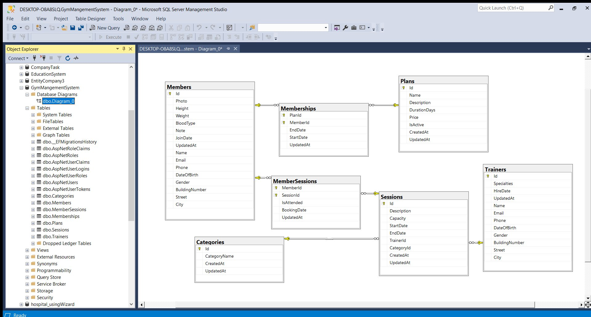

# 🏋️ Power Fitness – Gym Management System

A full-stack **ASP.NET Core MVC** web application for managing gym operations end-to-end. Built with a clean **3-tier architecture** (DAL / BLL / PL), following separation of concerns and best practices.

---

## 📸 Tech Stack

| Layer | Technology |
|-------|-----------|
| Frontend | ASP.NET Core MVC, Razor Views, Bootstrap 5 |
| Backend | C# / .NET 8, ASP.NET Core MVC |
| ORM | Entity Framework Core 8 |
| Database | Microsoft SQL Server |
| Auth | ASP.NET Core Identity (Role-based) |
| Mapping | AutoMapper 16 |
| Architecture | 3-Tier (DAL / BLL / PL) + Repository Pattern + Unit of Work |

---

## 🏗️ Architecture

```
GymManagementSystem/
├── GymMangementDAL/       # Data Access Layer
│   ├── Entities/          # Domain models
│   ├── Data/              # DbContext, Configurations, Seeding
│   └── Repositories/      # Generic Repository + Unit of Work
│
├── GymMangementBLL/       # Business Logic Layer
│   ├── Services/          # Business services (interfaces + implementations)
│   ├── ViewModels/        # DTOs per feature
│   └── MappingProfiles.cs # AutoMapper profiles
│
└── GymManagementPL/       # Presentation Layer
    ├── Controllers/        # MVC Controllers
    └── Views/              # Razor Views per controller
```

---

## ✨ Features

### 👥 Member Management
- Register new members with photo upload
- View member details and health records
- Update member information
- Delete members (with future session validation)

### 🧑‍🏫 Trainer Management
- Add and manage trainers with specialization (Yoga, Boxing, CrossFit, etc.)
- Update trainer contact and address info
- Remove trainers (blocked if they have upcoming sessions)

### 🗓️ Session Scheduling
- Create sessions with category, trainer, capacity, start/end time
- Edit and delete sessions (with booking validation)
- View available slots per session

### 💳 Membership Plans
- Manage subscription plans (Basic, Standard, Premium, Annual)
- Toggle plan active/inactive status
- Assign plans to members
- Cancel active memberships

### 📋 Session Bookings
- Book members into upcoming sessions (active membership required)
- Cancel bookings for upcoming sessions
- View all booked members per session

### ✅ Attendance Tracking
- Mark member attendance during ongoing sessions
- View attendance status per session in real time

### 🔐 Authentication & Authorization
- ASP.NET Core Identity integration
- Role-based access control (`SuperAdmin` role)
- Protected routes for sensitive management actions

---

## 🗄️ Database Diagram



---

## 🚀 Getting Started

### Prerequisites
- [.NET 8 SDK](https://dotnet.microsoft.com/download)
- [SQL Server](https://www.microsoft.com/en-us/sql-server)
- [Visual Studio 2022](https://visualstudio.microsoft.com/) or VS Code

### Setup

**1. Clone the repository**
```bash
git clone https://github.com/BassantWael816/GymManagementSytem.git
cd GymManagementSytem
```

**2. Configure the connection string**

In `GymManagementPL/appsettings.json`:
```json
"ConnectionStrings": {
  "DefaultConnection": "Server=YOUR_SERVER;Database=GymDB;Trusted_Connection=True;TrustServerCertificate=True"
}
```

**3. Run the application**
```bash
cd GymManagementPL
dotnet run
```

> ✅ The app auto-applies pending migrations and seeds initial data on first run.

---

## 📁 Key Design Patterns

- **Repository Pattern** – Generic repository with `GetAll`, `GetById`, `Add`, `Update`, `Delete`
- **Unit of Work** – Single `SaveChanges()` per transaction across repositories
- **Service Layer** – All business logic isolated in BLL services
- **AutoMapper** – Clean ViewModel ↔ Entity mapping with custom profiles
- **Dependency Injection** – All services and repositories registered via DI in `Program.cs`

---

## 👩‍💻 Author

**Bassant Wael**  
[GitHub](https://github.com/BassantWael816)
